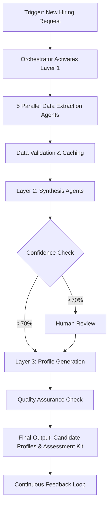

`models`: the JSON schemas, as Pydantic models.

`tools`: all non-LLM tooling (parsers, analyzers, web search).

`agents`: one file per conceptual agent.

`memory`: how you store “long-term memory” (strategic themes, etc.).

`workflows`: orchestrators that call the agents in the right order.

`main.py`: from CLI or notebook you call the workflow.


# Hiring Assessment Multi-Agent Architecture

## Agent Network Design

### Layer 1: Data Extraction Agents (Parallel Processing)

#### Agent 1.1: Strategic Context Extractor Maps high-level "why" to concrete business outcomes
**Responsibilities:**
- Analize strategic business objectives
- Identify transformation initiatives
- This information SHOULD BE STORED in the LONG TERM MEMORY

**Tools:**
- `document_parser`: Possible documents attached


**Output Schema:**
```json
{
  "strategic_themes": [],
  "success_metrics": [],
  "transformation_goals": [],
  "risk_factors": []
}
```

#### Agent 1.2: Pain Point Analyzer: Translates supervisor frustrations into capability requirements
**Responsibilities:**
- Process supervisor interviews/feedback
- Categorize pain points
- Prioritize bottlenecks

**Tools:**
- `bottleneck_classifier`: Categorizes pain points by type
- `impact`: Estimates productivity loss from each pain point

**Output Schema:**
```json
{
  "critical_pain_points": [],
  "productivity_impacts": {},
  "urgency_scores": {},
  "root_causes": []
}
```

#### Agent 1.3: Artifact Inspector A: Examines actual deliverables, codebase
**Responsibilities:**
- Analyze code repositories, documents, presentations
- Extract technology stack and tool usage
- Identify quality patterns
- MCP framework to parse a codebase


**Tools:**
- `code_analyzer`: Parses repos for languages, frameworks, patterns
- `document_scanner`: Extracts document types and complexity
- `process_miner`: Extracts workflows from tool logs (Jira, Slack, Git)


**Output Schema:** 
```json
{
  "tech_stack": [],
  "artifact_types": [],
  "complexity":[],
  "dependencies": []
}
```

#### Agent 1.4: Artifact Inspector B: Suggest general areas of possible improvement
**Responsibilities:**
- Analyze improvements


**Tools:**
- `code_analyzer`: Parses repos for languages, frameworks, patterns
- `document_scanner`: Extracts document types and complexity


**Output Schema:**
```json
{
 
}
```

#### Agent 1.5: Artifact Inspector C: Network patterns
**Responsibilities:**
- Map team collaboration patterns
- Identify communication channels

**Tools:**

- `collaboration_graph`: Builds interaction networks


**Output Schema:**
```json
{
  
}
```


### Layer semi2: Synthesis Agents (Convergent Processing)

#### Agent 1.6: Artifact Inspector B2: Search best practices on the suggested areas given by Agent 1.4
**Responsibilities:**


**Tools:**
- `Valyu`: Search


**Output Schema:**
```json
{
  
}
```


### Layer 2: Synthesis Agents (Convergent Processing)

#### Agent 2.1: Requirement Synthesizer
**Responsibilities:**
- Merge inputs from Layer 1 agents
- Resolve conflicts and contradictions
- Weight requirements by importance

**Tools:**


**Input:** All Layer 1 outputs
**Output Schema:**
```json
{
  "must_have_skills": [],
  "Performance multipliers-Capabilities that amplify team effectiveness ": [],
  "Growth Indicators - Signs candidate can evolve with role": {},
}
```

#### Agent 2.2: Market Intelligence Agent
**Responsibilities:**
- Validate requirements against market reality
- Benchmark salary expectations

**Tools:**
- `web_search`: 

**Output Schema:**
```json
{
  "market_availability": {},
  "salary_benchmarks": {},
  "competitive_landscape": [],
  "emerging_skills": [],
  "supply_demand_ratio": {}
}
```


### Layer 3: "BUT" AGENT (Creative Processing)


#### Agent 3.1: Find problems
**Responsibilities:**
- Conflicts and contradictions documented
- Feasability


###### DO NOT CONSIDER STILL BELOW INFORMATION


### Layer 3: Profile Generation Agents (Creative Processing)

#### Agent 3.1: Profile Architect
**Responsibilities:**
- Generate candidate profiles across spectrum
- Create persona narratives
- Define growth paths

**Tools:**
- `profile_generator`: Creates detailed candidate personas
- `pathway_designer`: Maps career progression scenarios
- `competency_modeler`: Builds skill progression frameworks

**Output Schema:**
```json
{
  "profile_spectrum": [
    {
      "level": "minimum_viable",
      "skills": [],
      "experience_years": 0,
      "salary_range": {},
      "ramp_time": "",
      "risk_score": 0
    }
  ],
  "growth_pathways": [],
  "training_requirements": []
}
```

#### Agent 3.2: Assessment Designer
**Responsibilities:**
- Create evaluation frameworks
- Generate interview questions
- Design practical assessments

**Tools:**
- `question_generator`: Creates behavioral and technical questions
- `rubric_builder`: Develops scoring frameworks
- `assessment_creator`: Designs practical exercises and case studies
- `bias_checker`: Validates assessments for fairness

**Output Schema:**
```json
{
  "interview_guides": [],
  "technical_assessments": [],
  "scoring_rubrics": {},
  "red_flags": [],
  "culture_fit_indicators": []
}
```

### Layer 4: Orchestration & Quality Control

#### Agent 4.1: Orchestrator Agent (Master Coordinator)
**Responsibilities:**
- Manage agent workflow and dependencies
- Handle errors and retries
- Ensure data consistency
- Trigger human validation when needed

**Tools:**
- `workflow_engine`: Manages agent execution order
- `dependency_resolver`: Ensures data prerequisites are met
- `validation_framework`: Checks output quality and completeness
- `human_in_loop_trigger`: Escalates uncertain decisions

#### Agent 4.2: Quality Assurance Agent
**Responsibilities:**
- Validate agent outputs
- Check for logical consistency
- Ensure completeness
- Flag anomalies

**Tools:**
- `consistency_checker`: Cross-validates agent outputs
- `completeness_validator`: Ensures all required fields are populated
- `anomaly_detector`: Identifies unusual patterns or outliers
- `feedback_aggregator`: Collects and processes human feedback

## Communication Protocol

### Message Bus Architecture
```yaml
message_format:
  agent_id: string
  timestamp: datetime
  message_type: [request, response, error, validation]
  payload: json
  priority: [high, medium, low]
  retry_count: integer
```

### Agent State Management
```yaml
states:
  - idle
  - processing
  - waiting_for_input
  - error
  - completed
  - human_review_required
```

## Failure Handling & Redundancy

### Circuit Breaker Pattern
- Each agent has failure threshold (3 strikes)
- Automatic fallback to simpler analysis
- Human escalation for critical failures

### Data Persistence
- All agent outputs cached in distributed store
- Incremental processing capability
- Rollback functionality for each layer

## Tool Integration Framework

### External API Integrations
- LinkedIn API: Skill validation and market data
- GitHub API: Code complexity analysis
- Glassdoor API: Salary benchmarking
- ATS Systems: Historical hiring data

### Internal Tool Connections
- HRIS: Organizational data
- Communication platforms: Workflow analysis
- Project management tools: Work artifact extraction
- Document repositories: Strategic document access

## Monitoring & Optimization

### Performance Metrics
```yaml
agent_metrics:
  - processing_time
  - accuracy_score
  - retry_rate
  - human_intervention_rate
  - output_quality_score
```

### Continuous Learning
- Feedback loop from successful hires
- Pattern recognition for improving profiles
- A/B testing different assessment strategies

## Security & Compliance

### Data Handling
- PII encryption at rest and in transit
- Role-based access control for agents
- Audit logging for all decisions
- GDPR/compliance checks on data retention

## Deployment Architecture

### Container Strategy
```yaml
deployment:
  layer_1_agents:
    replicas: 2  # Each agent can scale independently
    resources:
      cpu: 500m
      memory: 1Gi
  
  layer_2_agents:
    replicas: 1
    resources:
      cpu: 1000m
      memory: 2Gi
  
  layer_3_agents:
    replicas: 1
    resources:
      cpu: 750m
      memory: 1.5Gi
  
  orchestrator:
    replicas: 1  # Single instance with HA failover
    resources:
      cpu: 250m
      memory: 512Mi
```

### Message Queue
- Apache Kafka for agent communication
- Redis for caching and state management
- PostgreSQL for persistent storage

## Human-in-the-Loop Touchpoints

### Validation Gates
1. After Layer 1: Verify data extraction accuracy
2. After Layer 2: Confirm requirement synthesis
3. After Layer 3: Approve final profiles
4. Exception handling: Any confidence score <70%

### Override Mechanisms
- Human can adjust agent weights
- Manual profile modifications
- Custom requirement injection
- Veto on any agent decision

## Example Workflow Execution



## Scalability Considerations

### Horizontal Scaling
- Each agent type can scale independently
- Load balancing across agent instances
- Geographic distribution for global hiring

### Performance Optimization
- Async processing for non-dependent tasks
- Batch processing for similar requests
- Caching frequent market queries
- Pre-computed profile templates

## Cost Optimization

### Resource Management
- Agents spin down when idle
- Shared tool instances across agents
- Cached API responses to reduce external calls
- Progressive enhancement (start simple, add complexity as needed)

This architecture ensures no single agent becomes a bottleneck or single point of failure, while maintaining flexibility to adapt to different hiring scenarios and company needs.
